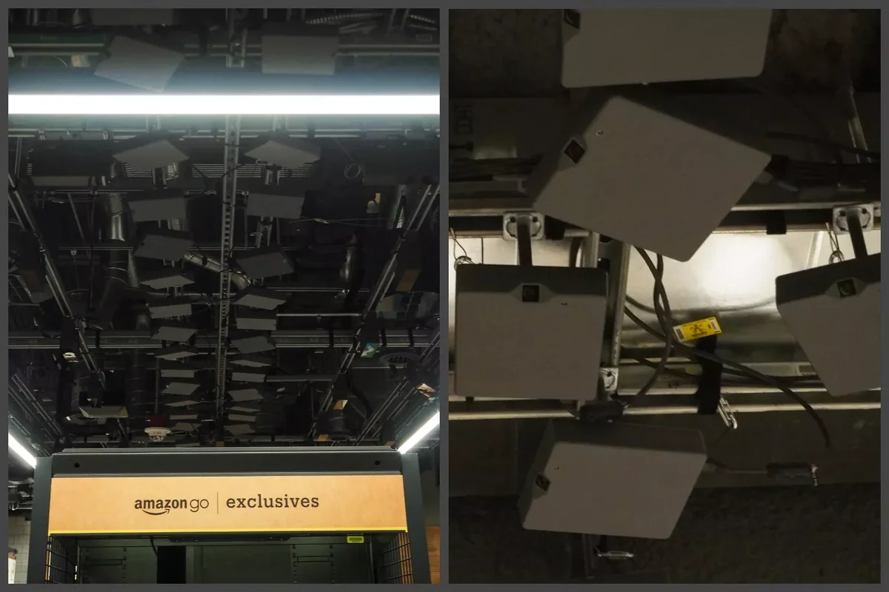
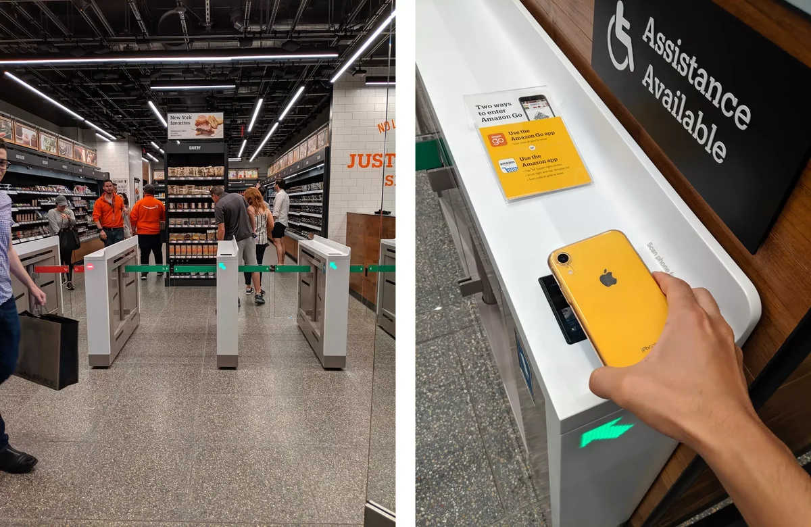
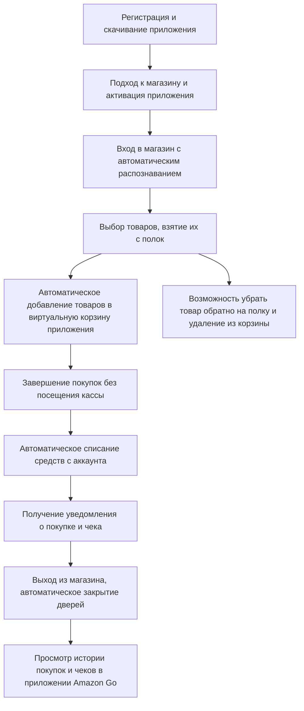

# IoT Amazon Go

## Идея

[_Amazon Go_](https://www.amazon.com/b?ie=UTF8&node=16008589011) - это инновационный проект, который представляет собой сеть магазинов без касс и кассиров, где клиенты могут входить, выбирать товары и выходить, не стоя в очередях и не проходя через кассу. Идея заключается в создании магазинов с автоматизированным учетом товаров и оплатой с использованием технологий Интернета вещей (IoT).

Идея Amazon Go заключается в создании магазинов без касс, где покупатели могут брать товары с полок, а их выбор будет автоматически определен и оплачен с использованием современных IoT технологий.

## Функциональность:

Amazon Go использует комплекс технологий, включая компьютерное зрение, машинное обучение и датчики, чтобы отслеживать движение и взаимодействие покупателей с товарами. Когда покупатель берет товар с полки, он автоматически добавляется в его виртуальную корзину, а при выходе из магазина счет автоматически списывается с его аккаунта[^1].

## Необходимые технологии:

Amazon Go использует несколько ключевых технологий и систем для обеспечения бесконтактного и автоматизированного опыта покупок:

1. **Камеры и компьютерное зрение**: В магазинах Amazon Go установлены множество камер и сенсоров, которые отслеживают движение клиентов и распознают товары, которые они берут с полок. Эта система компьютерного зрения помогает точно определить, какие товары были выбраны и добавить их в виртуальную корзину клиента.

   

2. **Машинное обучение**: Для обработки данных, получаемых от камер и сенсоров, а также для анализа поведения клиентов, Amazon Go использует алгоритмы машинного обучения. Эти алгоритмы позволяют системе корректно определить, что именно клиент взял с полок и сколько это стоит.

3. **Мобильное приложение**: Клиенты, желающие совершить покупку в магазинах Amazon Go, должны скачать мобильное приложение Amazon Go. Это приложение используется для входа в магазин, а также для связи с аккаунтом клиента и оплаты за товары.

   

4. **RFID и беспроводные технологии**: Некоторые товары в магазинах Amazon Go могут быть оборудованы RFID-метками или другими беспроводными технологиями, которые помогают системе точно определить, что было взято клиентом.
   > Возможно, RFID метки в системе Amazon Go служат дополнительной страховкой при возможных ошибках компьютерного зрения, например, при взятии нескольких товаров. Однако, из-за высоких затрат на постоянное использование RFID меток, основной акцент скорее делается на машинном зрении и обучении.

##  Варианты замены технологий:

- **RFID-технологии**: Вместо компьютерного зрения и машинного обучения можно усилить использование RFID-технологий. Это более точная и надежная система отслеживания товаров и клиентов. Основная проблема здесь - высокие затраты на метки и инфраструктуру. Однако, с развитием технологий, стоимость RFID-меток может снизиться.

- **Нейросети и искусственный интеллект**: Вместо существующих алгоритмов машинного обучения можно рассмотреть возможность использования более продвинутых нейронных сетей и технологий искусственного интеллекта. Это может повысить точность определения товаров и уменьшить количество ошибок.

- **QR-коды и мобильные приложения**: Вместо использования RFID или Bluetooth можно внедрить систему с QR-кодами. Каждый товар может иметь уникальный QR-код, который сканируется клиентами через мобильное приложение. Это позволит более точно отслеживать товары и их стоимость, но потребует от клиентов активного участия.

## Сценарии использования:

Для пользовательского сценария определена следующая последовательность действий:

## Ограничения:

Amazon Go имеет следующие ограничения:

1. **Зависимость от сети и надежности интернет-соединения**: Работоспособность системы Amazon Go напрямую зависит от надежности и доступности интернет-соединения. Если сеть отключится или будет низкая пропускная способность, это может привести к сбоям в системе и ограничить доступ клиентов.

2. **Сложность масштабирования**: Переход к более крупным сетям магазинов или другим проектам требует дополнительных усилий, что может быть сложным и затратным процессом.

3. **Ограничение при отсутствии телефона**: В случае, если телефон разряжен или утерян, клиент может оказаться в затруднительном положении и не сможет воспользоваться системой Amazon Go, так как при входе требуется авторизация через приложение.
   > Сейчас реализован вход при помощи Amazon app, кредитной карты или [Amazon One](https://one.amazon.com/how-it-works).[^2]

## Физические принципы:

1. **Компьютерное зрение и комплекс камер**: Важнейшим физическим элементом являются камеры и сенсоры, установленные в магазине. Они обеспечивают наблюдение за движением покупателей и товаров на полках.

2. **Беспроводные технологии (RFID и др.)**: Некоторые товары могут быть оборудованы RFID-метками или другими беспроводными технологиями, которые помогают системе точно определить, что было взято клиентом. Эти физические метки могут работать на радиочастотах и обеспечивать связь между товарами и системой.

3. **Мобильное приложение**: Мобильное приложение Amazon Go играет важную роль, так как оно связывает клиентов с системой магазина. Приложение обеспечивает идентификацию клиента, позволяет ему войти в магазин, взаимодействовать с виртуальной корзиной и проводить оплату.

[^1]: Пример работы - [YouTube](https://www.youtube.com/watch?v=NrmMk1Myrxc)
[^2]: Варианты входа в магазин оборудованный Amazon Go - [Amazon](https://www.amazon.com/b?ie=UTF8&node=16008589011#:~:text=Walk%20Out%20shopping-,1.%20Enter%20at%20gate,-Use%20the%20Amazon)
