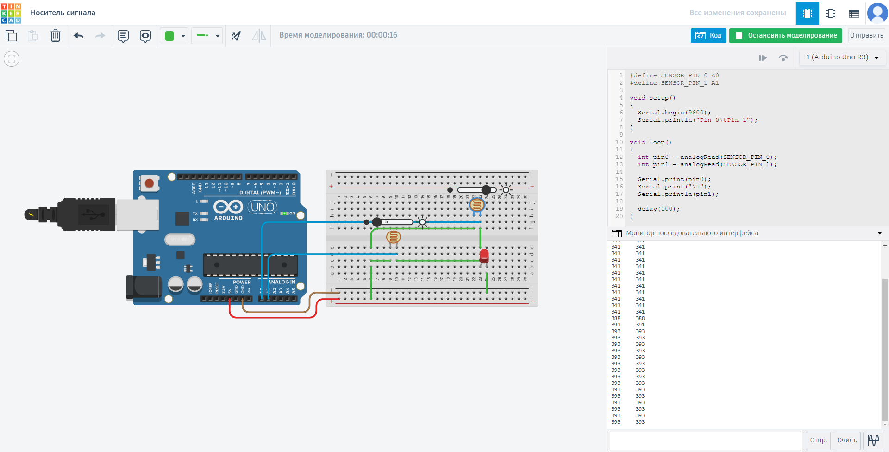
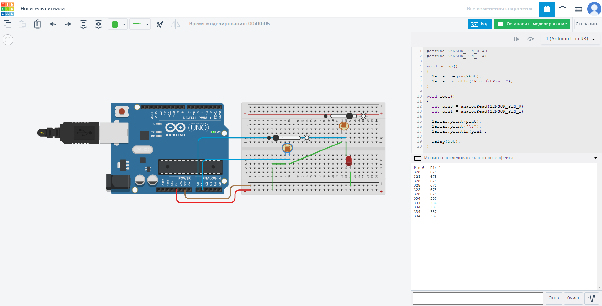

# Носитель сигнала

> Проверьте две гипотезы относительно носителя сигнала для микроконтроллера:
>
> 1. Носителем сигнала является ток (изменение силы тока влияет на показания, считываемые контроллером).
> 2. Носителем сигнала является напряжение (изменение напряжения влияет на показания, считываемые контроллером).

При параллельном соединении аналоговых пинов обеспечивается совпадение их значений.

В случае последовательного соединения наблюдается дифференциация значений.

Исходя из того, что при параллельном соединении:

- Напряжение в любых частях цепи одинаково: $U = U_1 = U_2 = \ldots = U_n$
- Сила тока равна сумме силы тока в отдельных проводниках: $I = I_1 + I_2 + \ldots + I_n$

А при последовательном соединении:

- Напряжение в цепи равно сумме напряжений на отдельных участках цепи: $U = U_1 + U_2 + \ldots + U_n$
- Сила тока в любых частях цепи одна и та же: $I = I_1 = I_2 = \ldots = I_n$

Можно сделать вывод о том, что схемы соответствуют случаям напряжения при подключении в разных типах соединения.
Следовательно, **напряжение является носителем сигнала**.
